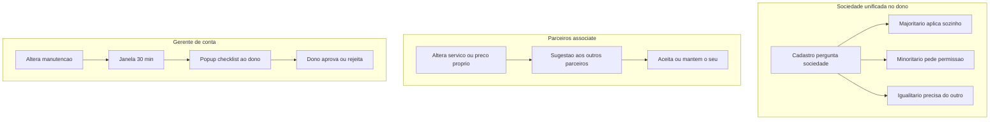

# Plano: avisos, sociedade, parceiros, contratado, booking e gerente de conta

Atualizado em 24/09/2026. **Implementação iniciada no código** — falta aplicar migrations no remoto e publicar Edge functions.

## Status da implementação

| Fase | Status |
|---|---|
| A Contratado nav | Feito (`ShopShell` + matriz de permissões) |
| B Avisos 30 min | Feito (migration + `ClientNoticeBell` + cron no dispatch) |
| C Favorito / aleatório | Feito (settings + `ArenaApp` + RPCs) |
| D Parceiros / branding / WA | Feito (sugestões UI+RPC; branding só sociedade; canal por staff) |
| E Sociedade / co-dono | Feito (signup + migrate partner→owner + labels + invite) |
| F Gerente de conta | Feito (tabelas/RPCs/TTL/checklist); UI de assign na plataforma ainda básica via RPC |

Migrations: `20260924170000_*`, `20260924180000_*`.

## Contexto do que já existe

| Conceito atual | Código | Destino |
|---|---|---|
| `partner` = **Sócio** (% sociedade) | `shop_members`, invite em `PlatformShell.tsx` | Unificar com **dono** (sociedade) |
| `associate` = **Parceiro** | `staff_services`, `PartnerOverview` | Mantém; ganha **sugestões** |
| `employee` = **Contratado** | caps + nav | Corrigir bounce p/ Agenda |
| Aprovações | `shop_change_requests` / `TeamGovernance.tsx` | Estender TTL 30 min + checklist |
| Aviso sino | `send_client_notice` (bloqueia 30 min) | Fila pendente + auto-envio |
| WA | 1 canal / loja | + canal opcional por parceiro |
| Booking | cliente escolhe barbeiro | + favorito / aleatório disponível |
| Plataforma | só `platform_admin` | + `account_manager` |

---

## Premissas fixadas

1. **“Sócio” some como papel.** Sociedade = vários membros com papel `owner` + `ownership_percent` + tipo derivado (`majority` / `minority` / `equal`). Convite antigo “sócio” vira “co-dono / sociedade”.
2. **Parceiro** continua sendo `associate` (carteira e catálogo próprios).
3. **Identidade visual** (cores, logo, fonte, cantos) é **só da marca da loja** — só majoritário / sociedade com poder de aplicar; parceiro **não** edita branding global.
4. **Sugestão entre parceiros** = proposta de espelhar serviço/preço do autor; cada um aceita ou mantém o próprio `staff_services`.
5. **Gerente de conta** nunca aplica direto: sempre cria pedido com TTL **30 min**; sem resposta → expira.
6. **Aviso do sino:** se cooldown ativo, grava **último gatilho pendente** e o cron envia quando completar 30 min (substitui gatilhos anteriores do mesmo cliente).
7. **Controle de sociedade e níveis de acesso (25/09):** o **dono/co-dono** convida equipe, altera papéis e edita a matriz no painel da loja (`ShopTeamAccessCard`). **Admin global** e **gerente da unidade** mantêm acesso total (override). A conta **fundadora** (`barbershops.founded_by_user_id`) não pode ser rebaixada/desativada sem `transfer_shop_founder`. Aplicação segue maj/igual/min (`can_apply_protected_change` / pedidos).

---

## 1) Avisos: fila pendente + auto-envio aos 30 min

**Hoje:** `send_client_notice` rejeita se houve envio há &lt; 30 min.

**Entrega**

- Tabela `staff_client_notice_pending` (`barbershop_id`, `customer_id`, `preset`, `requested_by`, `requested_at`, unique por cliente/loja).
- Em cooldown: **upsert** do último preset (não erro duro).
- UI: “Agendado — envia automaticamente em X min” (`ClientNoticeBell.tsx`).
- Função `process_pending_client_notices()` no cron com `whatsapp-dispatch` / `email-dispatch`: quando `last_sent + 30min <= now()`, envia e limpa pending.
- Mantém auditoria em `staff_client_notices`.

---

## 2) Sociedade: excluir “sócio”, unificar com dono

**Cadastro** (`cadastrar.tsx` + Edge `register-shop`)

- Após nome da loja: **“Há sociedade?”**
  - Não → dono 100% (`single`).
  - Sim → tipo: **majoritária** / **igualitária** / **minoritária** (sem perguntar valores financeiros além do % interno se já usado no convite).
- Convidar co-donos depois (e-mail) com %; regras:
  - **Majoritário (&gt;50%)**: aplica mudanças protegidas sozinho (já próximo de `can_apply_protected_change`).
  - **Igualitário**: precisa aprovação do outro (já existe).
  - **Minoritário**: **sempre** abre `request_shop_change` (hoje minoria é bloqueada sem propor — habilitar propor).

**Migração de papel**

- Migrar `role=partner` → `role=owner` com o mesmo `ownership_percent`.
- Remover opção “Sócio” no invite da plataforma; label “Co-dono / sociedade”.
- Atualizar `TeamGovernance.tsx`, `PlatformPermissionsEditor.tsx`, docs.

---

## 3) Parceiros: sugestões + WA individual + marca só global

### 3.1 Sugestões de serviços/preços

- Tabela `partner_catalog_suggestions` (`from_staff_id`, destino shop/broadcast, `service_id`, `proposed_price_cents`, `proposed_duration`, `status` pending/accepted/dismissed).
- Quando parceiro A altera `staff_services`, opcional “Sugerir aos outros parceiros”.
- UI: inbox “Sugestões” → Aceitar (grava no `staff_services` dele) / Manter o meu.
- Não altera o catálogo global da loja sem fluxo de sociedade.

### 3.2 WhatsApp

- Canal da **loja** (padrão) **ou** canal por `staff_id` (parceiro).
- Avisos/booking: se o atendimento é do parceiro e ele tem canal próprio conectado → usa o dele; senão → loja.
- UI: card WA em `PartnerOverview` / Ajustes do parceiro.

### 3.3 Branding

- Revogar write de branding para `associate`.
- Só majoritário / quem `can_apply_protected_change` edita identidade visual.

---

## 4) Bug contratado: aba Serviços volta para Agenda

**Causa** (`ShopShell.tsx` ~1327–1357):

- Nav **sempre** mostra Serviços.
- `useEffect` faz `setTab("agenda")` se `!canEditServices`.

**Correção**

- Filtrar nav: Serviços só se `manageCatalog || editOwnCatalog` (e leitura se houver cap).
- Remover bounce agressivo; se não tem cap, **não renderizar** a aba.
- Se tem `editOwnCatalog`: permanecer em Serviços.
- Teste: contratado com acesso fica na aba; sem acesso a aba some.

---

## 5) Booking: favorito + aleatório / disponibilidade

**Settings** em `barbershop_settings`:

- `staff_assignment_mode`: `client_pick` | `favorite_then_pick` | `random_available`.

**Cliente** (`ArenaApp.tsx` + perfil)

- Preferência `favorite_staff_id` por loja (`customer_shop_preferences`).
- Fluxos:
  - **client_pick** (hoje): lista de barbeiros.
  - **favorite_then_pick**: pré-seleciona favorito se ativo e com slot; senão disponíveis naquele horário.
  - **random_available**: UI “Qualquer profissional disponível”; no confirm, sorteia entre staff livres naquele instante (retry se race).
- Link `?barber=` continua mandatório naquele profissional.
- Slots no modo aleatório: horários em que **existe pelo menos um** staff livre.

---

## 6) Gerente de conta (plataforma)

**Papel novo:** `account_manager` (equipe do admin global).

**Atribuição:** admin vincula gerente ↔ N barbearias (`account_manager_shops`).

**Acesso**

- Dashboard da loja **somente leitura** se admin ligar `account_manager_can_view_dashboard`.
- Manutenção: **não aplica** — cria `shop_change_requests` com `source=account_manager`, `expires_at = now()+30min`.

**UX dono / majoritário**

- Popup/checklist: o que mudou (kind + diff resumido).
- Aprovar / rejeitar item a item ou lote.
- Timer visível; ao expirar → `expired`, nada aplicado.
- Mesmo padrão de checklist quando majoritário aplica lote (log `shop_change_events`).

**Tabelas**

- `account_manager_shops`
- Extensões em `shop_change_requests`: `expires_at`, `source`, `checklist jsonb`
- `shop_change_events` (audit para o popup)

**UI:** plataforma (gerentes, assign, toggle dashboard) + loja (central de aprovações em `TeamGovernance`).

---

## 7) Ordem de implementação

| Fase | Escopo | Risco |
|---|---|---|
| **A** | Bug contratado (nav Serviços) | Baixo — ship imediato |
| **B** | Fila de avisos 30 min + cron | Baixo |
| **C** | Favorito / aleatório + settings | Médio |
| **D** | Branding só sociedade; sugestões parceiros; WA por parceiro | Médio-alto |
| **E** | Migração partner→owner + signup sociedade + minoria propõe | Alto (dados) |
| **F** | Gerente de conta + TTL 30 min + checklist | Alto |

Dependências: **E** antes de **F** (mesmo motor de `shop_change_requests`). **D** pode ir em paralelo a **C**.

---

## 8) Arquivos principais

- Avisos: migration + `ClientNoticeBell.tsx` + dispatch cron
- Contradado: `ShopShell.tsx`, `capabilities.ts`
- Sociedade: `cadastrar.tsx`, `register-shop`, governance migrations, `TeamGovernance.tsx`
- Parceiros: `staff_services`, suggestions UI, WA channel por staff
- Booking: `ArenaApp.tsx`, `barbershop_settings`, preferências cliente
- Gerente: `PlatformShell.tsx`, migrations RLS, extensão governance
- Docs: `mb-operacao.md`, `CONTINUIDADE.md`

---

## 9) Aceite (anti-confusão)

- Segundo clique no sino em &lt;30 min agenda o **último** preset; envia sozinho depois.
- Não existe mais label “Sócio”; sociedade só via dono/co-dono com tipo maj/min/igual.
- Parceiro muda preço → outro vê sugestão, não herda à força.
- Parceiro não altera logo/cores da marca.
- Contratado com permissão fica em Serviços; sem permissão a aba não aparece.
- Dono liga “aleatório” → cliente marca horário e o sistema escolhe barbeiro livre.
- Gerente altera → dono vê checklist + timer 30 min; sem aprovação, zero efeito na loja.

---

## To-dos

1. Corrigir nav/bounce do contratado na aba Serviços
2. Fila pending de avisos + auto-envio após 30 min
3. Favorito + modo aleatório/disponível no booking
4. Sugestões entre parceiros, WA individual, branding só sociedade
5. Migrar sócio→co-dono, signup sociedade, minoria propõe
6. Papel gerente de conta + TTL 30 min + checklist de aprovação
